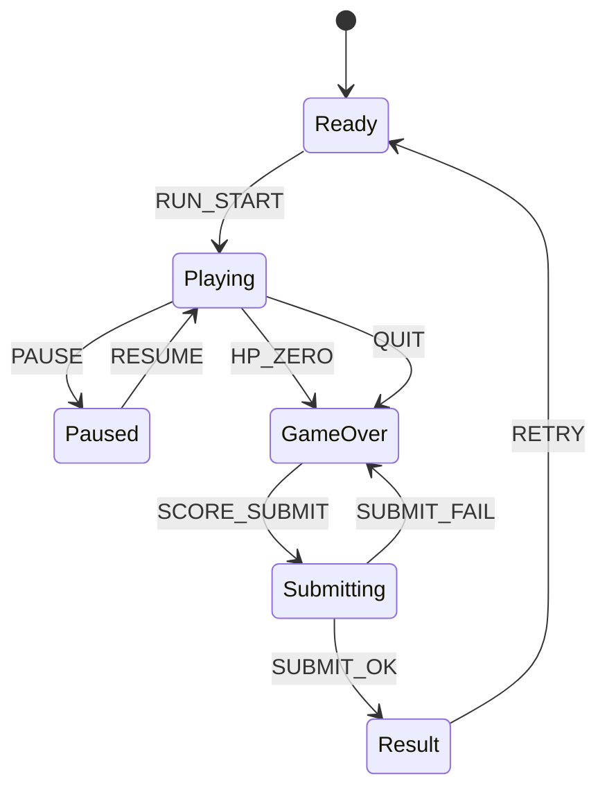

# Asteroid Lane Break

## 한 줄 컨셉
3개 레인을 오가며 소행성 웨이브를 파괴해 콤보 점수를 쌓는 고속 레인 슈팅 아케이드.

## 리더보드 점수 공식
- 최종 점수 = (소행성 처치 점수 × 콤보 배수) + 생존 시간(초) × 10 + 무피격 보너스

## 동점 처리
- 동점 시 1) 플레이 시간 짧은 순 2) 피격 횟수 적은 순 3) 먼저 달성한 기록 순

## 장르/플랫폼
- 장르: 레인 슈팅
- 플랫폼: Web(React)
- 플레이 타임: 2~5분

## 핵심 루프
- 레인 이동으로 탄막 회피 -> 소행성 파괴 -> 콤보 유지 -> 전멸 시 종료

## 조작
- 좌/우: 레인 이동, Space: 차지 샷

## 리더보드 운영 메모
- 시즌 단위(예: 4주)로 초기화하고 시즌 최고 점수 1개만 반영
- 서버에서 점수 이벤트 로그를 재집계해 클라이언트 제출 점수 검증

## 상태머신 다이어그램

## 이벤트 타입 정의
- `RUN_START`: `{ runId, seed, startedAt }`
- `LANE_CHANGE`: `{ runId, fromLane, toLane, ts }`
- `SHOT_FIRE`: `{ runId, shotType, ts }`
- `ASTEROID_HIT`: `{ runId, asteroidId, damage, ts }`
- `ASTEROID_DESTROY`: `{ runId, asteroidId, combo, scoreDelta, ts }`
- `PLAYER_HIT`: `{ runId, hpAfter, ts }`
- `RUN_END`: `{ runId, reason, survivalSec, finalScore, ts }`
- `SCORE_SUBMIT`: `{ runId, finalScore, checksum }`

