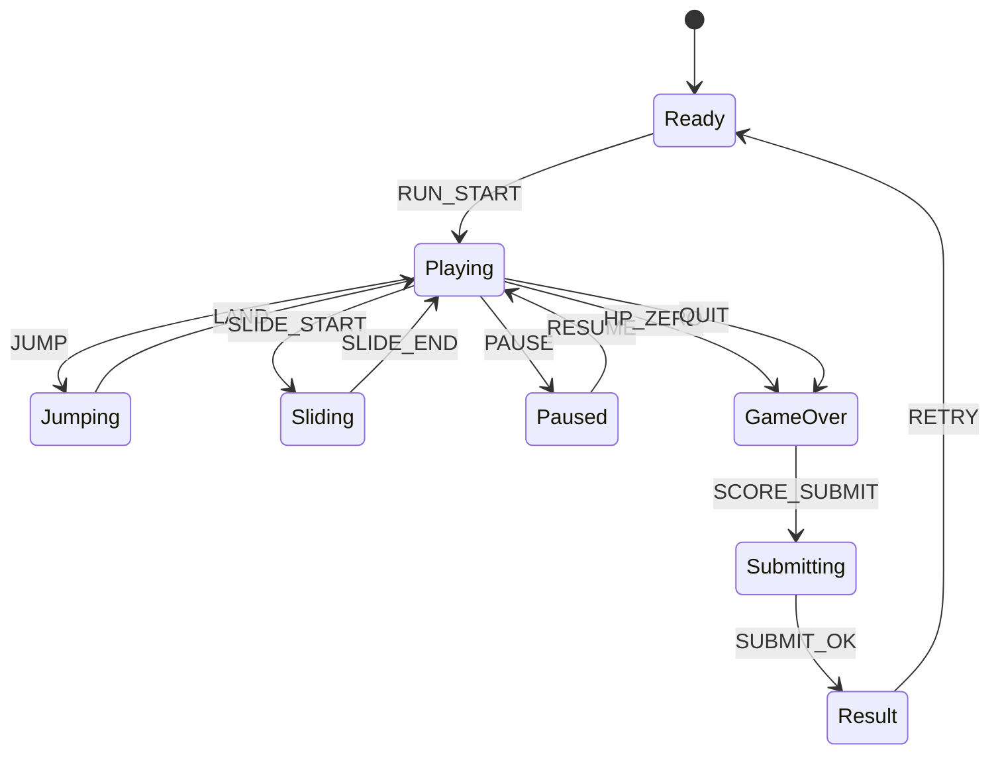

# Blade Rail Strike

## 한 줄 컨셉
레일 위를 질주하며 장애물을 넘고 적을 베어 무피격 배수를 키우는 액션 러너.

## 리더보드 점수 공식
- 최종 점수 = 이동 거리(m) × 5 + 적 처치 점수 + 무피격 유지 시간(초) × 8

## 동점 처리
- 동점 시 1) 무피격 유지 시간 긴 순 2) 플레이 시간 짧은 순 3) 먼저 달성한 기록 순

## 장르/플랫폼
- 장르: 액션 러너
- 플랫폼: Web(React)
- 플레이 타임: 2~4분

## 핵심 루프
- 전방 패턴 인식 -> 점프/슬라이드/베기 -> 배수 누적 -> 피격 시 배수 초기화

## 조작
- 위/아래: 점프/슬라이드, Z: 베기

## 리더보드 운영 메모
- 시즌 단위(예: 4주)로 초기화하고 시즌 최고 점수 1개만 반영
- 서버에서 점수 이벤트 로그를 재집계해 클라이언트 제출 점수 검증

## 상태머신 다이어그램

## 이벤트 타입 정의
- `RUN_START`: `{ runId, seed, startedAt }`
- `MOVE_TICK`: `{ runId, distanceDelta, speed, ts }`
- `JUMP`: `{ runId, ts }`
- `SLIDE_START`: `{ runId, ts }`
- `ATTACK_HIT`: `{ runId, targetId, scoreDelta, ts }`
- `OBSTACLE_HIT`: `{ runId, hpAfter, ts }`
- `MULTIPLIER_UPDATE`: `{ runId, multiplier, ts }`
- `RUN_END`: `{ runId, reason, distance, finalScore, ts }`

