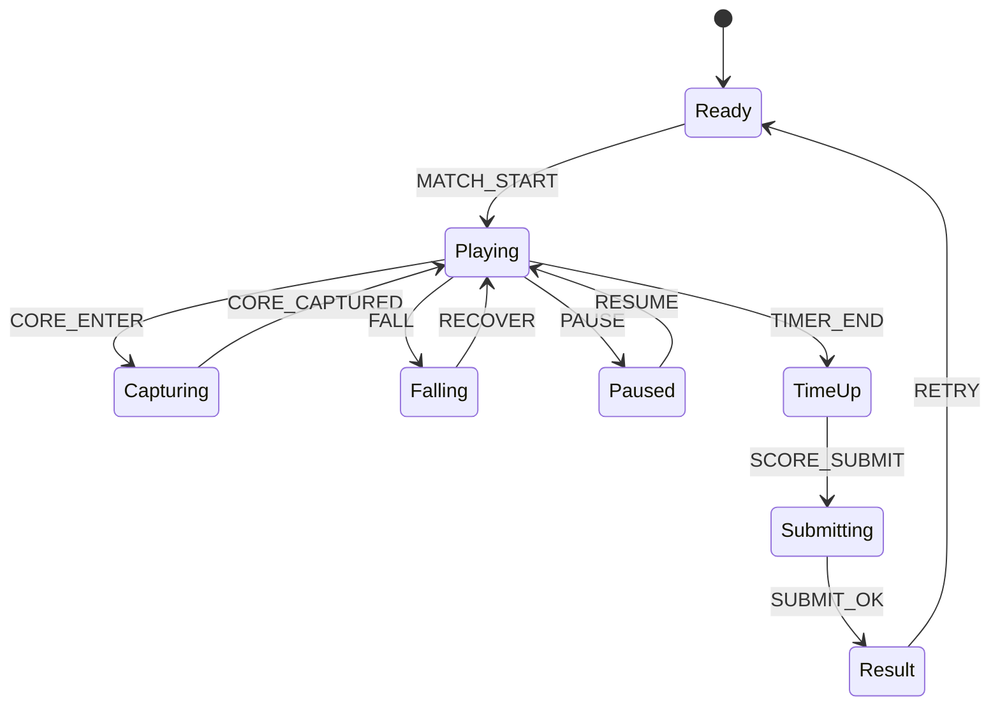

# Clockwork Surge

## 한 줄 컨셉
회전 기어를 넘나들며 코어를 연속 점거해 점수를 폭발시키는 점프 액션 게임.

## 리더보드 점수 공식
- 최종 점수 = 코어 점거 점수 + 연속 점거 콤보 보너스 + 남은 시간(초) × 20

## 동점 처리
- 동점 시 1) 최대 연속 점거 수 높은 순 2) 낙하 횟수 적은 순 3) 먼저 달성한 기록 순

## 장르/플랫폼
- 장르: 플랫폼 액션
- 플랫폼: Web(React)
- 플레이 타임: 3분 고정

## 핵심 루프
- 기어 점프 이동 -> 코어 점거 -> 연속 점거 콤보 -> 낙하/피격 시 콤보 끊김

## 조작
- 좌/우: 이동, Space: 점프, Shift: 대시

## 리더보드 운영 메모
- 시즌 단위(예: 4주)로 초기화하고 시즌 최고 점수 1개만 반영
- 서버에서 점수 이벤트 로그를 재집계해 클라이언트 제출 점수 검증

## 상태머신 다이어그램

## 이벤트 타입 정의
- `MATCH_START`: `{ runId, timeLimitSec, seed, ts }`
- `MOVE`: `{ runId, x, y, ts }`
- `CORE_ENTER`: `{ runId, coreId, ts }`
- `CORE_CAPTURED`: `{ runId, coreId, combo, scoreDelta, ts }`
- `FALL`: `{ runId, y, ts }`
- `DASH_USE`: `{ runId, cooldownLeftMs, ts }`
- `TIMER_TICK`: `{ runId, remainSec, ts }`
- `MATCH_END`: `{ runId, finalScore, capturedCount, ts }`

