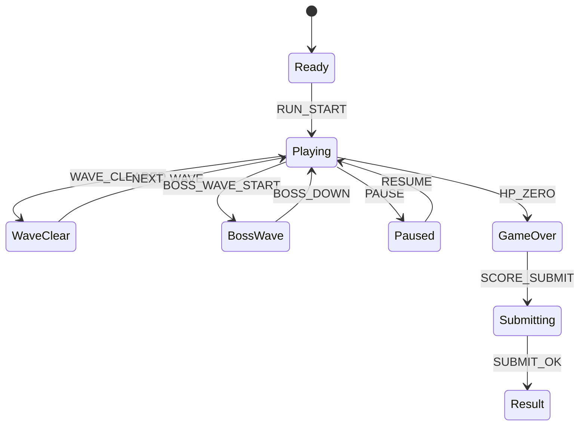

# Drone Sweep Zero

## 한 줄 컨셉
원형 아레나에서 몰려오는 드론을 쓸어 담아 웨이브 점수를 누적하는 탑다운 슈터.

## 리더보드 점수 공식
- 최종 점수 = 웨이브 처치 점수 + 근접 회피 보너스 + 웨이브 클리어 보너스

## 동점 처리
- 동점 시 1) 최고 웨이브 높은 순 2) 피격 횟수 적은 순 3) 먼저 달성한 기록 순

## 장르/플랫폼
- 장르: 아레나 슈터
- 플랫폼: Web(React)
- 플레이 타임: 4~6분

## 핵심 루프
- 웨이브 진입 -> 이동 사격 생존 -> 근접 회피 보너스 -> 보스 웨이브 돌파

## 조작
- WASD: 이동, 마우스: 조준/발사, Space: 긴급 회피

## 리더보드 운영 메모
- 시즌 단위(예: 4주)로 초기화하고 시즌 최고 점수 1개만 반영
- 서버에서 점수 이벤트 로그를 재집계해 클라이언트 제출 점수 검증

## 상태머신 다이어그램

## 이벤트 타입 정의
- `RUN_START`: `{ runId, seed, startedAt }`
- `ENEMY_SPAWN`: `{ runId, wave, enemyType, enemyId, ts }`
- `SHOT_FIRE`: `{ runId, weapon, ts }`
- `ENEMY_KILL`: `{ runId, enemyId, wave, scoreDelta, ts }`
- `NEAR_MISS`: `{ runId, enemyId, bonus, ts }`
- `WAVE_CLEARED`: `{ runId, wave, bonusScore, ts }`
- `PLAYER_HIT`: `{ runId, hpAfter, ts }`
- `RUN_END`: `{ runId, reason, wave, finalScore, ts }`

