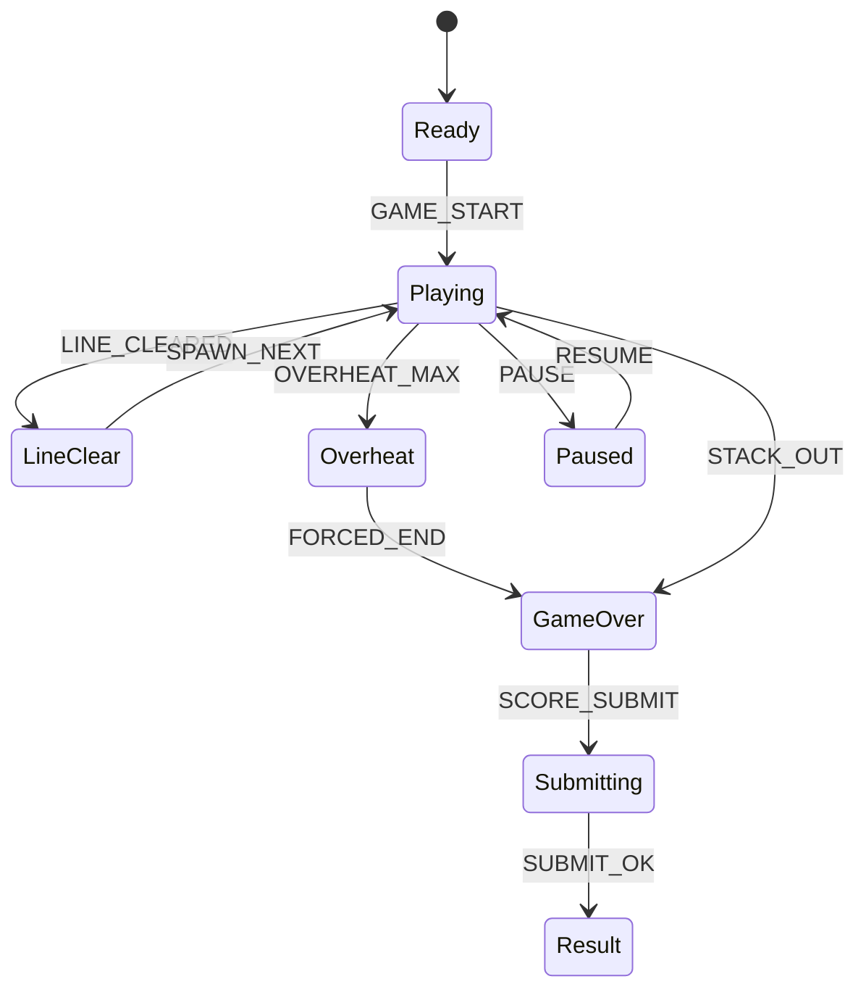

# Ember Block Fall

## 한 줄 컨셉
떨어지는 블록을 빠르게 배치해 연속 라인 삭제로 고득점을 노리는 퍼즐 아케이드.

## 리더보드 점수 공식
- 최종 점수 = 라인 삭제 기본점수 + 백투백 보너스 + 연속 삭제 콤보 보너스

## 동점 처리
- 동점 시 1) 최대 콤보 높은 순 2) 총 라인 삭제 수 높은 순 3) 먼저 달성한 기록 순

## 장르/플랫폼
- 장르: 폴링 퍼즐
- 플랫폼: Web(React)
- 플레이 타임: 3~8분

## 핵심 루프
- 블록 배치 -> 라인 삭제 -> 과열 게이지 관리 -> 과열 폭주 시 종료

## 조작
- 좌/우: 이동, 회전, 소프트/하드 드롭

## 리더보드 운영 메모
- 시즌 단위(예: 4주)로 초기화하고 시즌 최고 점수 1개만 반영
- 서버에서 점수 이벤트 로그를 재집계해 클라이언트 제출 점수 검증

## 상태머신 다이어그램

## 이벤트 타입 정의
- `GAME_START`: `{ runId, seed, ts }`
- `PIECE_SPAWN`: `{ runId, pieceId, pieceType, ts }`
- `PIECE_LOCK`: `{ runId, pieceId, x, y, rotation, ts }`
- `LINE_CLEARED`: `{ runId, lines, b2b, combo, scoreDelta, ts }`
- `OVERHEAT_ADD`: `{ runId, heatDelta, heatNow, ts }`
- `OVERHEAT_COOL`: `{ runId, heatNow, ts }`
- `GAME_END`: `{ runId, reason, linesTotal, finalScore, ts }`

