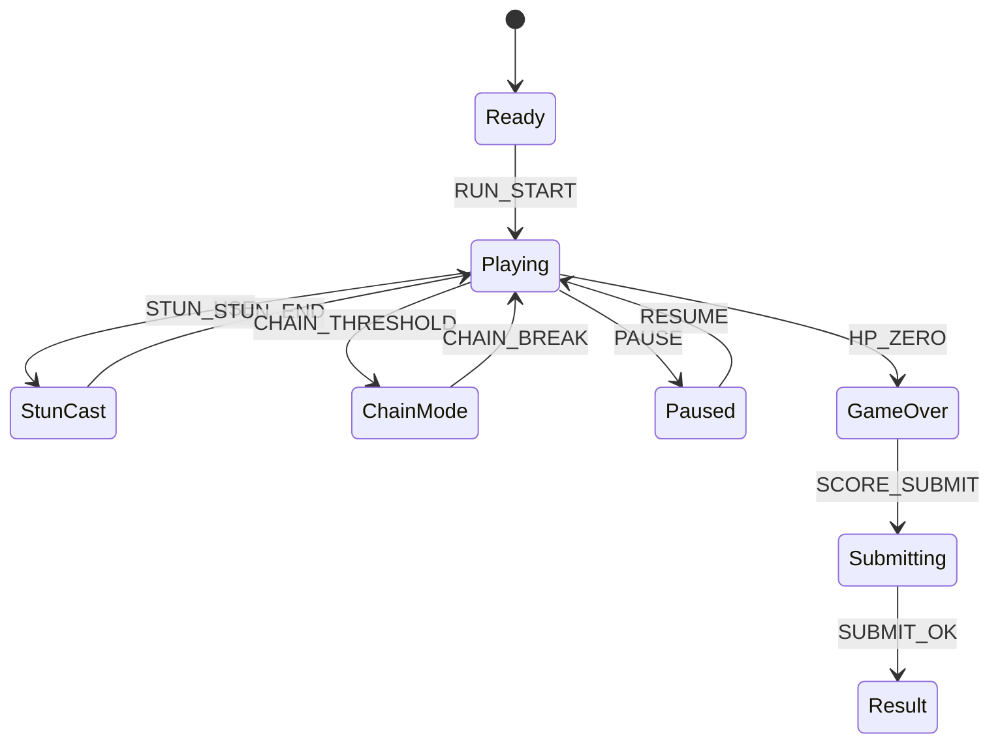

# Frost Bite Rush

## 한 줄 컨셉
빙판 관성을 활용해 몬스터를 연쇄 격파하며 배수를 올리는 아레나 액션.

## 리더보드 점수 공식
- 최종 점수 = 적 처치 점수 + 연쇄 격파 배수 보너스 + 생존 시간(초) × 6

## 동점 처리
- 동점 시 1) 최대 연쇄 처치 수 높은 순 2) 피격 횟수 적은 순 3) 먼저 달성한 기록 순

## 장르/플랫폼
- 장르: 아레나 액션
- 플랫폼: Web(React)
- 플레이 타임: 3~5분

## 핵심 루프
- 빙판 관성 이동 -> 몬스터 유도 -> 범위 공격 연쇄 처치 -> 피격 시 배수 감소

## 조작
- WASD: 이동, 좌클릭: 기본 공격, 우클릭: 스턴

## 리더보드 운영 메모
- 시즌 단위(예: 4주)로 초기화하고 시즌 최고 점수 1개만 반영
- 서버에서 점수 이벤트 로그를 재집계해 클라이언트 제출 점수 검증

## 상태머신 다이어그램

## 이벤트 타입 정의
- `RUN_START`: `{ runId, seed, ts }`
- `MOVE`: `{ runId, vx, vy, ts }`
- `ATTACK_HIT`: `{ runId, targetId, chainCount, scoreDelta, ts }`
- `CHAIN_BREAK`: `{ runId, chainFinal, ts }`
- `STUN_USE`: `{ runId, cooldownLeftMs, ts }`
- `PLAYER_HIT`: `{ runId, hpAfter, ts }`
- `RUN_END`: `{ runId, reason, maxChain, finalScore, ts }`

