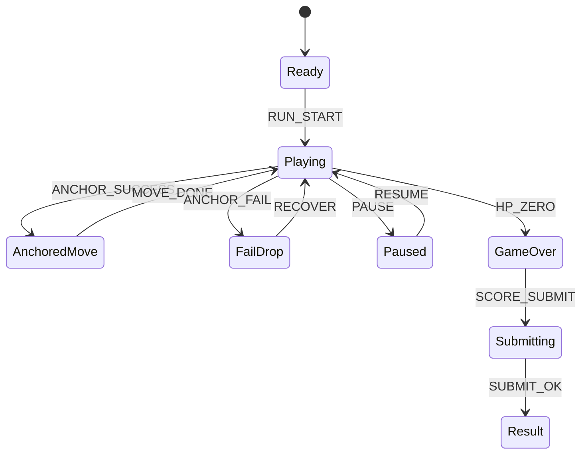

# Gravity Hook Runner (MVP)

## 한 줄 컨셉
앵커 포인트를 타이밍 좋게 붙잡아 상승 거리를 경쟁하는 간소화 훅 액션 러너.

## 리더보드 점수 공식
- 최종 점수 = 상승 거리(m) × 5 + 연속 앵커 성공 보너스 + 무피격 보너스

## 동점 처리
- 동점 시 1) 최대 연속 앵커 수 높은 순 2) 플레이 시간 짧은 순 3) 먼저 달성한 기록 순

## 장르/플랫폼
- 장르: 러너 + 타이밍 액션
- 플랫폼: Web(React)
- 플레이 타임: 2~4분

## MVP 축약 규칙
- 중력 반전 제거
- 로프 물리 제거, "앵커 자동 스냅 + 고정 궤적 이동" 사용
- 앵커는 화면에 최대 3개만 활성화
- 이동 실패 시 즉시 낙하 페널티(체력 1 감소)
- 체력 0 또는 화면 하단 이탈 시 종료

## 핵심 루프
- 앵커 등장 확인 -> 클릭으로 스냅 이동 -> 연속 성공으로 배수 상승 -> 실패 시 배수 초기화

## 조작
- 클릭: 앵커 연결/점프

## 리더보드 운영 메모
- 시즌 최고 점수 1개 반영
- 서버에서 `anchor_success`, `anchor_fail`, `distance_tick`, `damage` 이벤트 재집계

## 상태머신 다이어그램

## 이벤트 타입 정의
- `RUN_START`: `{ runId, seed, ts }`
- `ANCHOR_SPAWN`: `{ runId, anchorId, x, y, ts }`
- `ANCHOR_SUCCESS`: `{ runId, anchorId, chain, distanceDelta, ts }`
- `ANCHOR_FAIL`: `{ runId, hpAfter, ts }`
- `DISTANCE_TICK`: `{ runId, distanceTotal, ts }`
- `CHAIN_BREAK`: `{ runId, chainFinal, ts }`
- `RUN_END`: `{ runId, reason, distanceTotal, finalScore, ts }`

