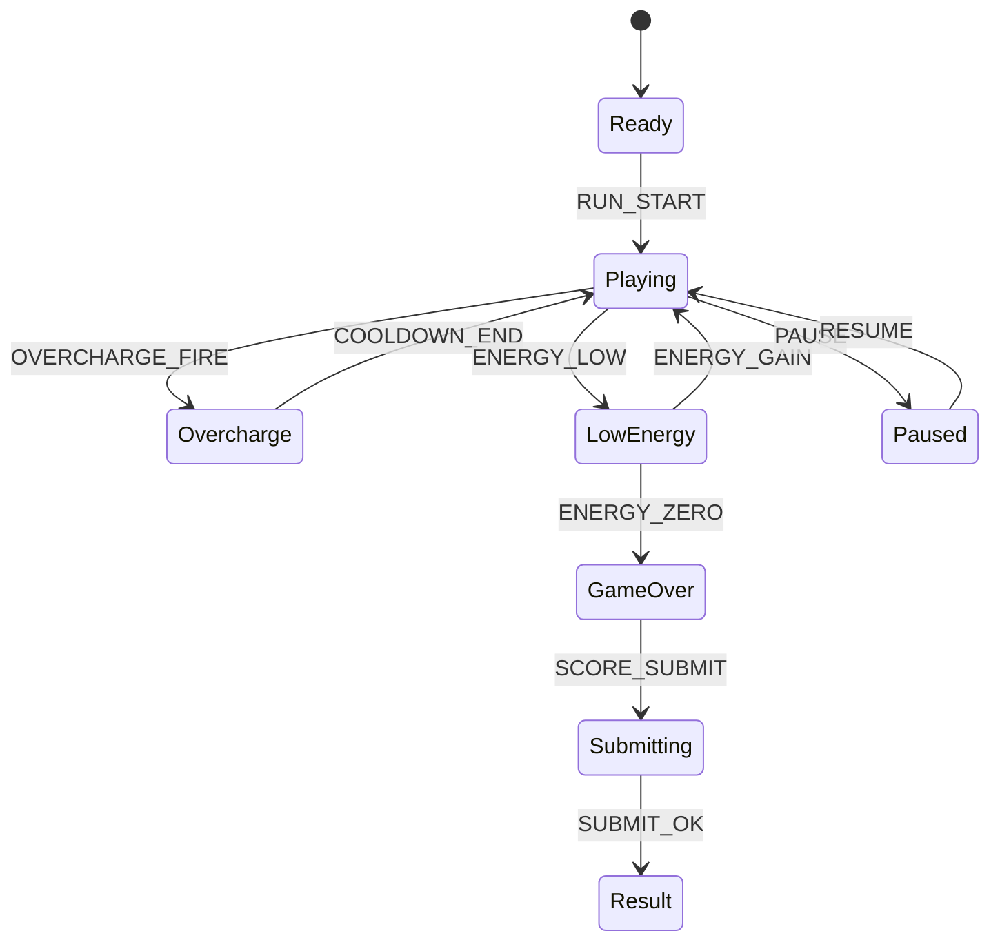

# Laser Miner Blast

## 한 줄 컨셉
레이저로 광맥과 적을 동시에 돌파해 제한 에너지 안에서 최대 점수를 노리는 액션 채굴.

## 리더보드 점수 공식
- 최종 점수 = 광석 수집 점수 + 적 처치 점수 + 남은 에너지 × 15

## 동점 처리
- 동점 시 1) 채굴 효율(광석/초) 높은 순 2) 피격 횟수 적은 순 3) 먼저 달성한 기록 순

## 장르/플랫폼
- 장르: 슈팅 + 채굴
- 플랫폼: Web(React)
- 플레이 타임: 2~4분

## 핵심 루프
- 갱도 전진 -> 광맥 파괴 수집 -> 적 드론 처리 -> 에너지 소진 전 점수 극대화

## 조작
- 좌/우: 이동, 마우스: 조준 레이저, Space: 과충전 샷

## 리더보드 운영 메모
- 시즌 단위(예: 4주)로 초기화하고 시즌 최고 점수 1개만 반영
- 서버에서 점수 이벤트 로그를 재집계해 클라이언트 제출 점수 검증

## 상태머신 다이어그램

## 이벤트 타입 정의
- `RUN_START`: `{ runId, seed, energyInit, ts }`
- `LASER_FIRE`: `{ runId, power, energyCost, ts }`
- `ORE_BREAK`: `{ runId, oreId, oreType, scoreDelta, ts }`
- `ENEMY_KILL`: `{ runId, enemyId, scoreDelta, ts }`
- `ENERGY_CHANGE`: `{ runId, delta, energyNow, ts }`
- `OVERCHARGE_FIRE`: `{ runId, cooldownMs, ts }`
- `RUN_END`: `{ runId, reason, energyLeft, finalScore, ts }`

