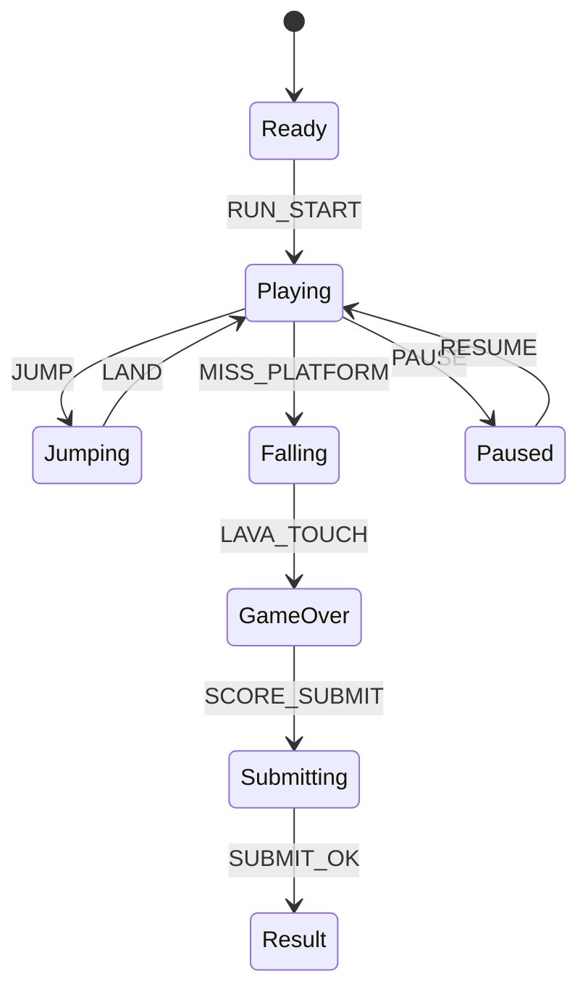

# Lava Hop Legend

## 한 줄 컨셉
솟아오르는 용암을 피해 사라지는 발판을 점프하며 최고 고도를 겨루는 생존 점프 게임.

## 리더보드 점수 공식
- 최종 점수 = 도달 고도 점수 + 연속 점프 콤보 보너스 + 용암 근접 회피 보너스

## 동점 처리
- 동점 시 1) 최고 고도 도달 시간 짧은 순 2) 낙하 횟수 적은 순 3) 먼저 달성한 기록 순

## 장르/플랫폼
- 장르: 점프 생존
- 플랫폼: Web(React)
- 플레이 타임: 1~3분

## 핵심 루프
- 발판 경로 선택 -> 정확 점프 -> 부스터 수집 -> 높이 기록 갱신

## 조작
- 좌/우: 이동, Space: 점프(차징)

## 리더보드 운영 메모
- 시즌 단위(예: 4주)로 초기화하고 시즌 최고 점수 1개만 반영
- 서버에서 점수 이벤트 로그를 재집계해 클라이언트 제출 점수 검증

## 상태머신 다이어그램

## 이벤트 타입 정의
- `RUN_START`: `{ runId, seed, lavaSpeed, ts }`
- `JUMP`: `{ runId, chargeMs, ts }`
- `LAND`: `{ runId, platformId, height, combo, ts }`
- `PLATFORM_BREAK`: `{ runId, platformId, ts }`
- `NEAR_LAVA`: `{ runId, bonus, ts }`
- `HEIGHT_TICK`: `{ runId, heightMax, ts }`
- `RUN_END`: `{ runId, reason, heightMax, finalScore, ts }`

