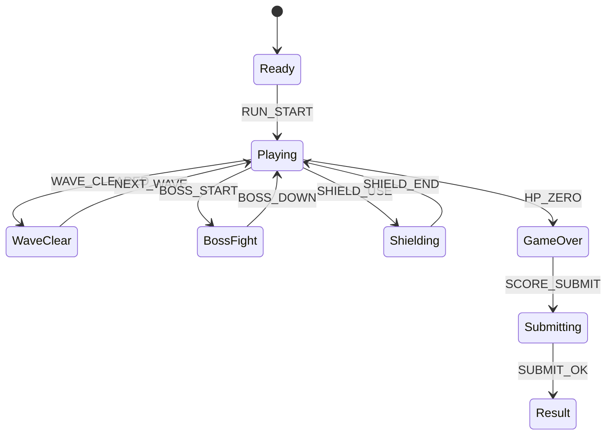

# Mecha Dash Raid (MVP)

## 한 줄 컨셉
2레일만 오가며 탄막을 피하고 약점 코어를 파괴해 점수를 올리는 경량 탄막 액션.

## 리더보드 점수 공식
- 최종 점수 = 적 격파 점수 + 웨이브 클리어 보너스 + 남은 실드 × 25

## 동점 처리
- 동점 시 1) 클리어 웨이브 높은 순 2) 피격 횟수 적은 순 3) 먼저 달성한 기록 순

## 장르/플랫폼
- 장르: 탄막 회피
- 플랫폼: Web(React)
- 플레이 타임: 3~5분

## MVP 축약 규칙
- 3레일/자유이동 제거, 좌/우 2레일 고정
- 무기 전환 제거, 기본 샷 1종만 사용
- 탄 패턴은 6개 프리셋만 순환
- 보스는 1종, 2페이즈만 구현
- 화면 탄 개수 상한(예: 120발) 적용

## 핵심 루프
- 레일 이동 회피 -> 기본 샷 공격 -> 웨이브 정리 -> 보스 코어 타격

## 조작
- 좌/우: 레일 이동, Z: 발사, Space: 실드(짧은 쿨타임)

## 리더보드 운영 메모
- 시즌 최고 점수 1개 반영
- 서버에서 `kill`, `wave_clear`, `hit`, `shield_use` 이벤트 재집계

## 상태머신 다이어그램

## 이벤트 타입 정의
- `RUN_START`: `{ runId, seed, ts }`
- `RAIL_SWITCH`: `{ runId, lane, ts }`
- `SHOT_FIRE`: `{ runId, ts }`
- `ENEMY_KILL`: `{ runId, enemyId, wave, scoreDelta, ts }`
- `WAVE_CLEARED`: `{ runId, wave, bonusScore, ts }`
- `BOSS_WEAK_HIT`: `{ runId, bossId, phase, scoreDelta, ts }`
- `PLAYER_HIT`: `{ runId, shieldAfter, ts }`
- `RUN_END`: `{ runId, reason, wave, finalScore, ts }`

