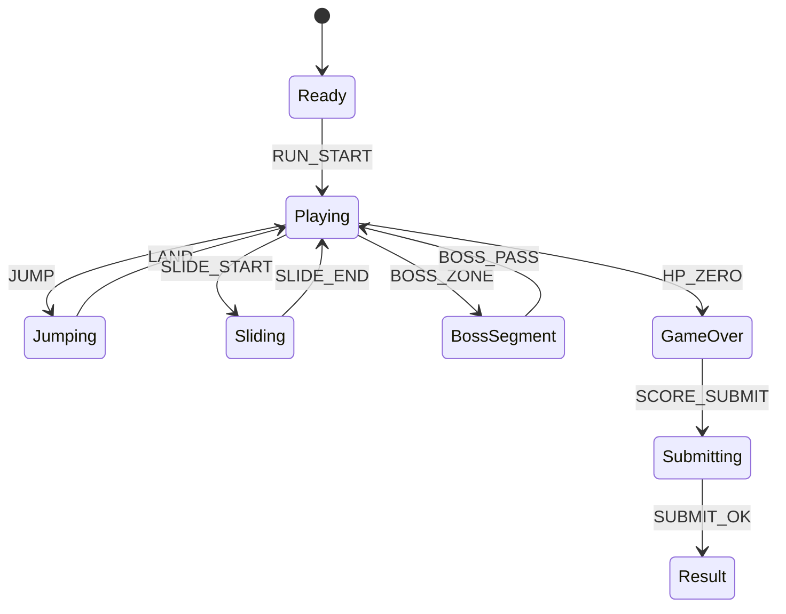

# Metro Zombie Sprint

## 한 줄 컨셉
지하철 선로를 질주하며 회피와 처치를 반복해 거리 기반 점수를 올리는 하드코어 런너.

## 리더보드 점수 공식
- 최종 점수 = 이동 거리(m) × 5 + 좀비 처치 점수 + 무피격 보너스

## 동점 처리
- 동점 시 1) 무피격 유지 거리 긴 순 2) 플레이 시간 짧은 순 3) 먼저 달성한 기록 순

## 장르/플랫폼
- 장르: 2D 런너
- 플랫폼: Web(React)
- 플레이 타임: 2~5분

## 핵심 루프
- 패턴 인식 -> 차선 전환/점프/슬라이드 -> 근접 공격 -> 보스 구간 돌파

## 조작
- 좌/우: 차선 변경, 위: 점프, 아래: 슬라이드, Z: 밀치기

## 리더보드 운영 메모
- 시즌 단위(예: 4주)로 초기화하고 시즌 최고 점수 1개만 반영
- 서버에서 점수 이벤트 로그를 재집계해 클라이언트 제출 점수 검증

## 상태머신 다이어그램

## 이벤트 타입 정의
- `RUN_START`: `{ runId, seed, ts }`
- `LANE_CHANGE`: `{ runId, lane, ts }`
- `MOVE_TICK`: `{ runId, distanceDelta, speed, ts }`
- `ZOMBIE_KILL`: `{ runId, zombieId, scoreDelta, ts }`
- `OBSTACLE_HIT`: `{ runId, hpAfter, ts }`
- `NO_HIT_BONUS`: `{ runId, streakSec, scoreDelta, ts }`
- `RUN_END`: `{ runId, reason, distanceTotal, finalScore, ts }`

