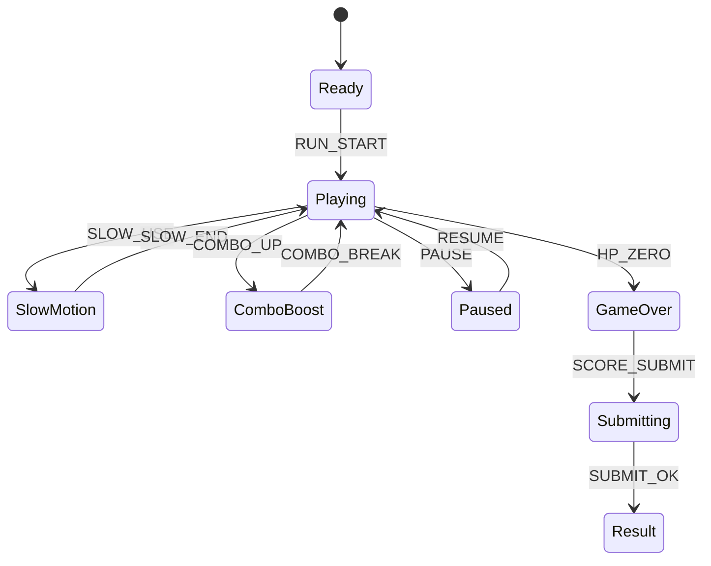

# Neon Drift Dash

## 한 줄 컨셉
차선을 바꾸며 장애물을 피하고 부스터 콤보를 이어 고득점을 노리는 네온 레이싱 아케이드.

## 리더보드 점수 공식
- 최종 점수 = 코인 점수 + 근접 회피 점수 + 콤보 배수 보너스

## 동점 처리
- 동점 시 1) 최대 콤보 높은 순 2) 피격 횟수 적은 순 3) 먼저 달성한 기록 순

## 장르/플랫폼
- 장르: 회피 + 스코어어택
- 플랫폼: Web(React)
- 플레이 타임: 2~4분

## 핵심 루프
- 코인/부스터 수집 -> 장애물 회피 -> 콤보 배수 상승 -> 피격 시 콤보 초기화

## 조작
- A/D 또는 좌/우: 차선 변경, Space: 슬로모션

## 리더보드 운영 메모
- 시즌 단위(예: 4주)로 초기화하고 시즌 최고 점수 1개만 반영
- 서버에서 점수 이벤트 로그를 재집계해 클라이언트 제출 점수 검증

## 상태머신 다이어그램

## 이벤트 타입 정의
- `RUN_START`: `{ runId, seed, ts }`
- `LANE_CHANGE`: `{ runId, fromLane, toLane, ts }`
- `COIN_COLLECT`: `{ runId, coinId, scoreDelta, ts }`
- `NEAR_MISS`: `{ runId, obstacleId, scoreDelta, ts }`
- `COMBO_UP`: `{ runId, combo, multiplier, ts }`
- `COMBO_BREAK`: `{ runId, comboFinal, ts }`
- `PLAYER_HIT`: `{ runId, hpAfter, ts }`
- `RUN_END`: `{ runId, reason, finalScore, ts }`

