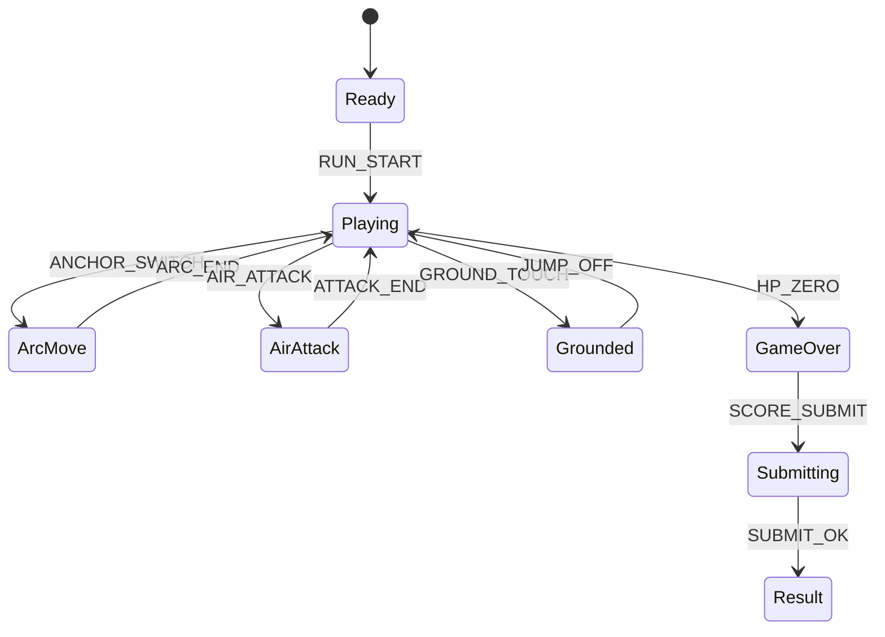

# Ninja Rope Chaos (MVP)

## 한 줄 컨셉
고정 앵커 사이를 스윙 점프로 연결해 공중 처치 콤보를 쌓는 닌자 액션.

## 리더보드 점수 공식
- 최종 점수 = 표적 처치 점수 + 공중 콤보 보너스 + 무착지 시간(초) × 10

## 동점 처리
- 동점 시 1) 최대 공중 콤보 높은 순 2) 무착지 시간 긴 순 3) 먼저 달성한 기록 순

## 장르/플랫폼
- 장르: 스윙 액션
- 플랫폼: Web(React)
- 플레이 타임: 2~4분

## MVP 축약 규칙
- 실시간 로프 장력 물리 제거
- 맵에 고정 앵커 노드만 배치, 연결 시 "원호 이동 애니메이션"으로 처리
- 앵커 전환 쿨다운 0.25초 고정
- 적은 직선 이동 타입 2종만 사용
- 지면 충돌 시 콤보 즉시 초기화

## 핵심 루프
- 앵커 선택 -> 원호 이동 -> 공중 공격 -> 다음 앵커 전환

## 조작
- 클릭: 앵커 연결, Z: 공중 공격

## 리더보드 운영 메모
- 시즌 최고 점수 1개 반영
- 서버에서 `anchor_switch`, `air_kill`, `ground_touch`, `combo_break` 이벤트 재집계

## 상태머신 다이어그램

## 이벤트 타입 정의
- `RUN_START`: `{ runId, seed, ts }`
- `ANCHOR_SWITCH`: `{ runId, anchorId, chain, ts }`
- `AIR_ATTACK`: `{ runId, targetId, scoreDelta, ts }`
- `GROUND_TOUCH`: `{ runId, comboBroken, ts }`
- `NO_GROUND_TICK`: `{ runId, airTimeSec, ts }`
- `PLAYER_HIT`: `{ runId, hpAfter, ts }`
- `RUN_END`: `{ runId, reason, maxAirChain, finalScore, ts }`

