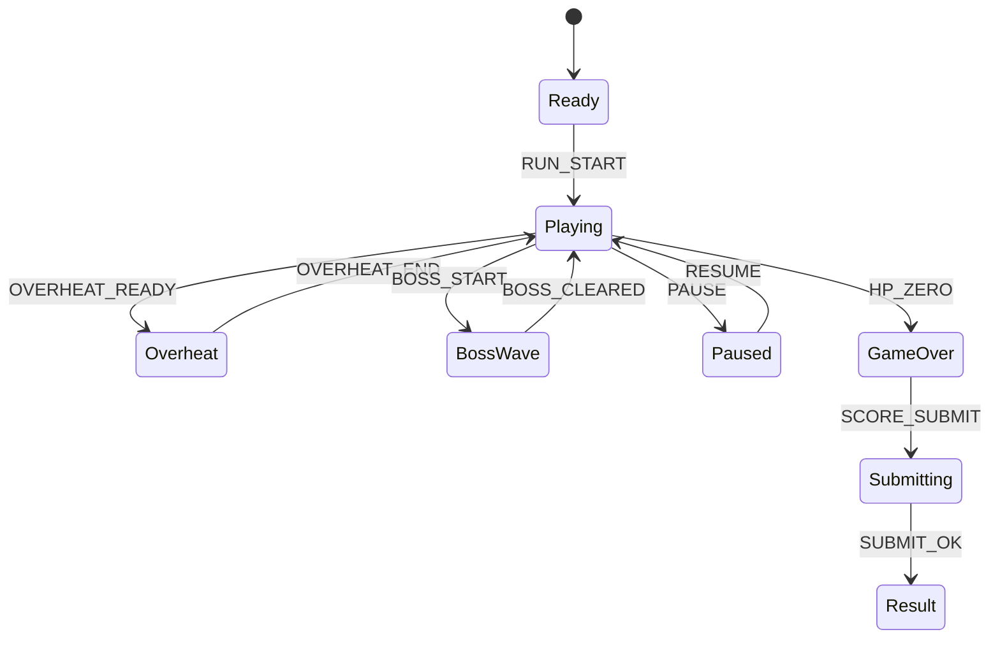

# Orbit Smash

## 한 줄 컨셉
코어를 공전하는 해머를 조작해 파편 웨이브를 막고 생존 점수를 겨루는 원버튼 게임.

## 리더보드 점수 공식
- 최종 점수 = 파편 파괴 점수 + 생존 시간(초) × 10 + 오버히트 연속 처치 보너스

## 동점 처리
- 동점 시 1) 최고 생존 시간 긴 순 2) 오버히트 연속 처치 수 높은 순 3) 먼저 달성한 기록 순

## 장르/플랫폼
- 장르: 서바이벌 아케이드
- 플랫폼: Web(React)
- 플레이 타임: 3~6분

## 핵심 루프
- 접근 각도 파악 -> 회전 입력 -> 연속 파괴 -> 오버히트 발동

## 조작
- 클릭/Space: 회전 방향 전환

## 리더보드 운영 메모
- 시즌 단위(예: 4주)로 초기화하고 시즌 최고 점수 1개만 반영
- 서버에서 점수 이벤트 로그를 재집계해 클라이언트 제출 점수 검증

## 상태머신 다이어그램

## 이벤트 타입 정의
- `RUN_START`: `{ runId, seed, ts }`
- `ROTATE_TOGGLE`: `{ runId, direction, ts }`
- `FRAGMENT_DESTROY`: `{ runId, fragmentId, scoreDelta, ts }`
- `CHAIN_KILL`: `{ runId, chainCount, scoreDelta, ts }`
- `OVERHEAT_READY`: `{ runId, gauge, ts }`
- `PLAYER_HIT`: `{ runId, hpAfter, ts }`
- `RUN_END`: `{ runId, reason, survivalSec, finalScore, ts }`

