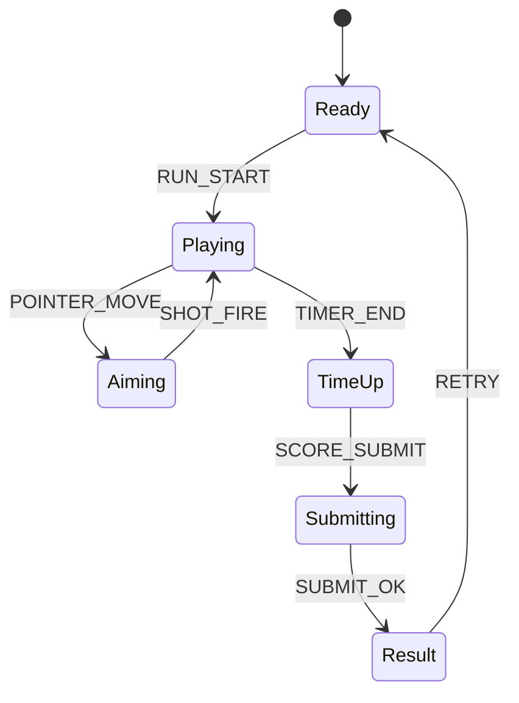

# Pinpoint Sniper Pop

## 한 줄 컨셉
90초 동안 출현 타깃을 정확히 맞혀 명중 기반 점수를 쌓는 정밀 반응 사격 게임.

## 리더보드 점수 공식
- 최종 점수 = 명중 점수 + 헤드샷 보너스 - 오발 페널티

## 동점 처리
- 동점 시 1) 명중률 높은 순 2) 헤드샷 비율 높은 순 3) 먼저 달성한 기록 순

## 장르/플랫폼
- 장르: 반응속도 슈팅
- 플랫폼: Web(React)
- 플레이 타임: 90초 고정

## 핵심 루프
- 타깃 출현 인식 -> 조준 사격 -> 고난도 타깃 처리 -> 시간 종료 정산

## 조작
- 마우스: 조준/발사

## 리더보드 운영 메모
- 시즌 단위(예: 4주)로 초기화하고 시즌 최고 점수 1개만 반영
- 서버에서 점수 이벤트 로그를 재집계해 클라이언트 제출 점수 검증

## 상태머신 다이어그램

## 이벤트 타입 정의
- `RUN_START`: `{ runId, seed, timeLimitSec, ts }`
- `TARGET_SPAWN`: `{ runId, targetId, targetType, ts }`
- `SHOT_FIRE`: `{ runId, x, y, ts }`
- `TARGET_HIT`: `{ runId, targetId, zone, scoreDelta, ts }`
- `MISS_SHOT`: `{ runId, penalty, ts }`
- `TIMER_TICK`: `{ runId, remainSec, ts }`
- `RUN_END`: `{ runId, finalScore, accuracy, ts }`

