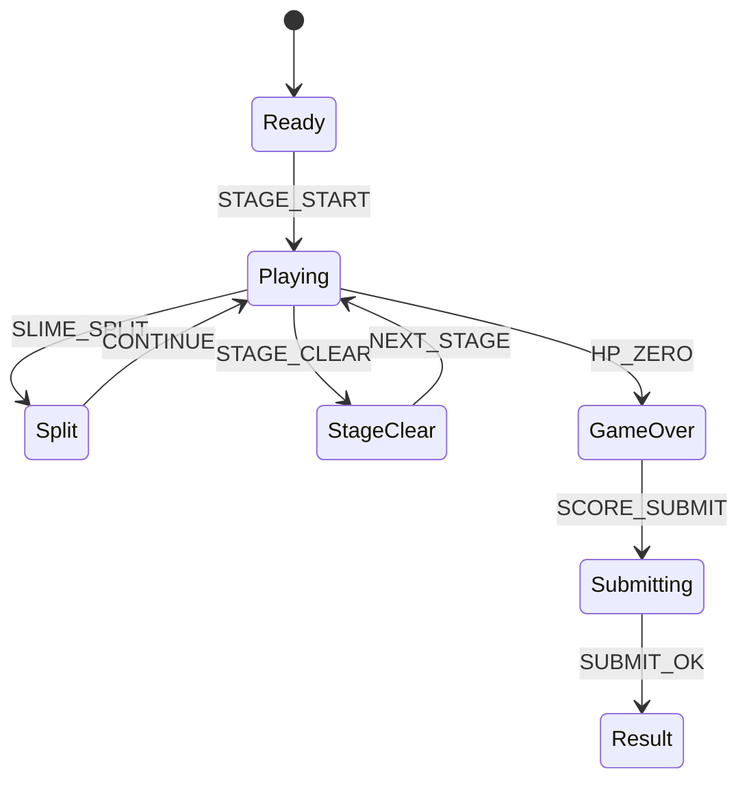

# Pixel Pang Quest

## 한 줄 컨셉
분열 슬라임을 공략하며 스테이지를 빠르게 클리어해 점수를 겨루는 클래식 팡 액션.

## 리더보드 점수 공식
- 최종 점수 = 스테이지 클리어 점수 + 남은 시간(초) × 25 + 피격 패널티

## 동점 처리
- 동점 시 1) 클리어 시간 짧은 순 2) 피격 횟수 적은 순 3) 먼저 달성한 기록 순

## 장르/플랫폼
- 장르: 2D 액션 아케이드
- 플랫폼: Web(React)
- 플레이 타임: 스테이지 1~2분

## 핵심 루프
- 슬라임 분열 대응 -> 회피/공격 -> 클리어 보너스 확보 -> 다음 스테이지

## 조작
- 좌/우 이동, 점프, 발사

## 리더보드 운영 메모
- 시즌 단위(예: 4주)로 초기화하고 시즌 최고 점수 1개만 반영
- 서버에서 점수 이벤트 로그를 재집계해 클라이언트 제출 점수 검증

## 상태머신 다이어그램

## 이벤트 타입 정의
- `STAGE_START`: `{ runId, stage, seed, ts }`
- `HARPOON_FIRE`: `{ runId, ts }`
- `SLIME_HIT`: `{ runId, slimeId, hpAfter, ts }`
- `SLIME_SPLIT`: `{ runId, slimeId, childCount, ts }`
- `ITEM_PICKUP`: `{ runId, itemType, ts }`
- `PLAYER_HIT`: `{ runId, hpAfter, ts }`
- `STAGE_CLEAR`: `{ runId, stage, remainSec, scoreDelta, ts }`
- `RUN_END`: `{ runId, reason, stageReached, finalScore, ts }`

