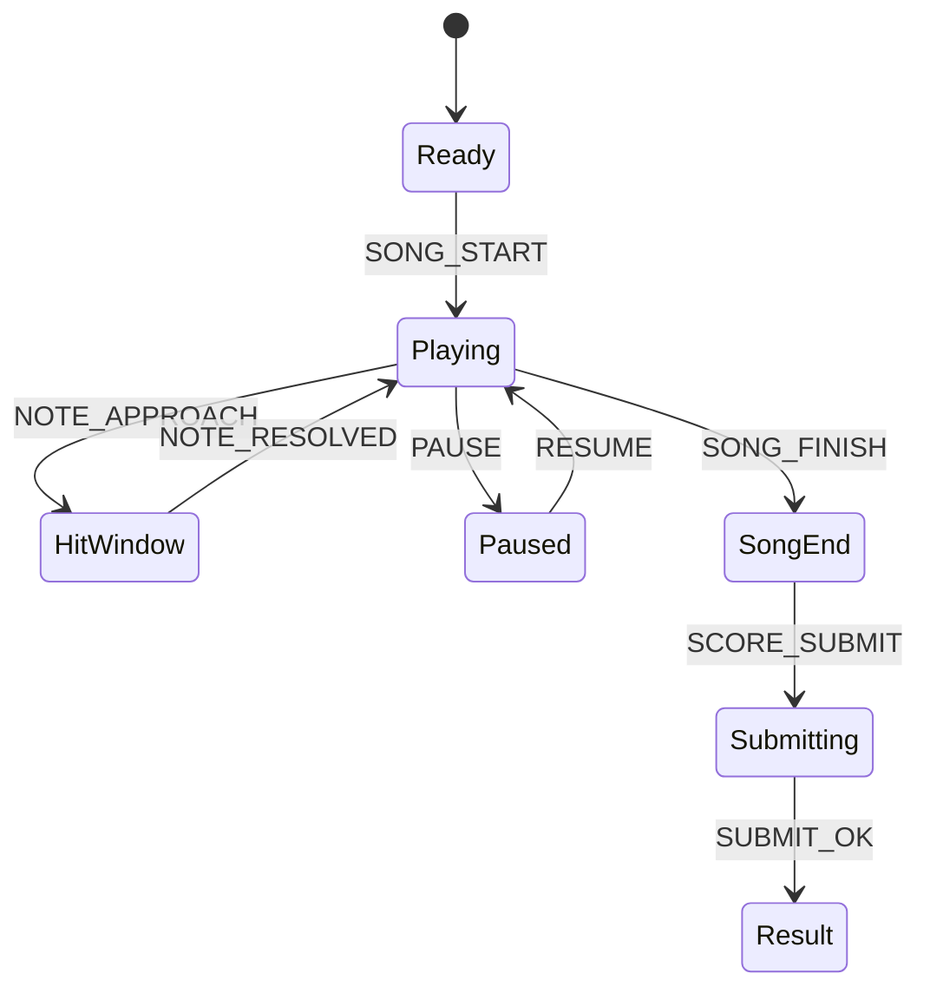

# Rhythm Blade Slice (MVP)

## 한 줄 컨셉
고정 BPM 트랙에서 3레인 노트를 판정해 점수를 경쟁하는 리듬 액션.

## 리더보드 점수 공식
- 최종 점수 = 판정 점수(Perfect/Good/Miss) + 콤보 보너스

## 동점 처리
- 동점 시 1) Perfect 수 높은 순 2) 최대 콤보 높은 순 3) 먼저 달성한 기록 순

## 장르/플랫폼
- 장르: 리듬 + 액션
- 플랫폼: Web(React)
- 플레이 타임: 곡당 2분

## MVP 축약 규칙
- 다중 곡 제거, 고정 1곡 + 고정 BPM만 사용
- 입력은 3레인(Left/Down/Right)만 지원
- 피버 시스템 제거
- 판정 구간 고정(Perfect ±40ms, Good ±90ms)
- 오디오 오프셋 캘리브레이션(수동 ±150ms) 제공

## 핵심 루프
- 노트 접근 확인 -> 레인 입력 -> 판정 누적 -> 곡 종료 정산

## 조작
- 방향키 Left/Down/Right

## 리더보드 운영 메모
- 시즌 최고 점수 1개 반영
- 서버에서 `note_hit`, `note_miss`, `combo_tick`, `song_end` 이벤트 재집계

## 상태머신 다이어그램

## 이벤트 타입 정의
- `SONG_START`: `{ runId, chartId, bpm, offsetMs, ts }`
- `NOTE_SPAWN`: `{ runId, noteId, lane, hitAtMs }`
- `INPUT`: `{ runId, lane, inputAtMs }`
- `NOTE_HIT`: `{ runId, noteId, judge, errorMs, combo, scoreDelta, ts }`
- `NOTE_MISS`: `{ runId, noteId, comboBroken, ts }`
- `OFFSET_CHANGE`: `{ runId, offsetMs, ts }`
- `SONG_END`: `{ runId, finalScore, perfect, good, miss, ts }`

