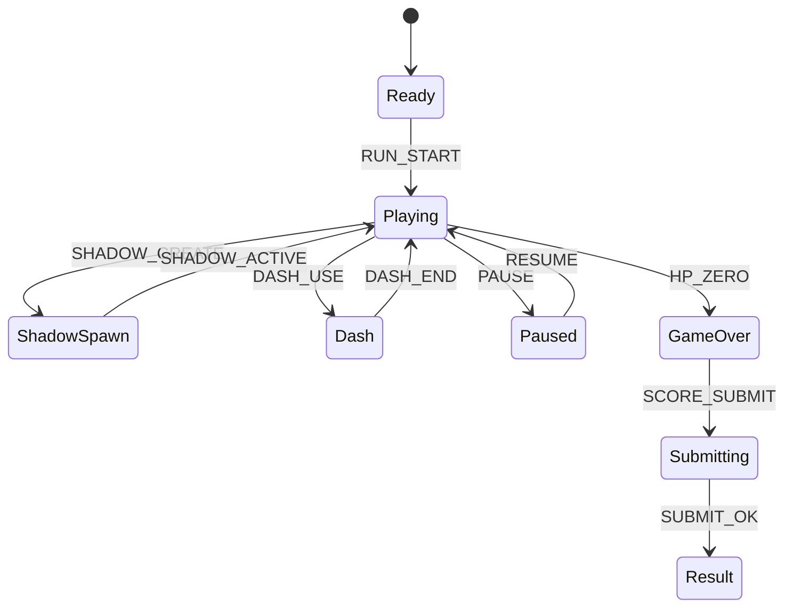

# Shadow Dodge Arena (MVP)

## 한 줄 컨셉
플레이어의 과거 8초 이동을 단순 복제한 그림자를 피하며 생존 점수를 올리는 아레나 게임.

## 리더보드 점수 공식
- 최종 점수 = 생존 시간(초) × 10 + 근접 회피 보너스 + 그림자 처치 점수

## 동점 처리
- 동점 시 1) 생존 시간 긴 순 2) 피격 횟수 적은 순 3) 먼저 달성한 기록 순

## 장르/플랫폼
- 장르: 아레나 회피
- 플랫폼: Web(React)
- 플레이 타임: 2~4분

## MVP 축약 규칙
- 이동 로그 길이를 8초 고정, 0.2초 간격 샘플링
- 동시 그림자 최대 6개 제한
- 그림자 AI 제거, "기록 경로 그대로 재생"만 수행
- 충돌은 원형 히트박스 1개로 통일
- 정지 펄스 스킬 제거, 대시 1개만 유지

## 핵심 루프
- 이동 생존 -> 그림자 생성 -> 경로 예측 회피 -> 제한 시간 버티기

## 조작
- WASD: 이동, Space: 대시

## 리더보드 운영 메모
- 시즌 최고 점수 1개 반영
- 서버에서 `survival_tick`, `near_miss`, `shadow_kill`, `hit` 이벤트 재집계

## 상태머신 다이어그램

## 이벤트 타입 정의
- `RUN_START`: `{ runId, seed, logWindowSec, ts }`
- `MOVE_LOG`: `{ runId, x, y, ts }`
- `SHADOW_CREATE`: `{ runId, shadowId, fromLogAt, ts }`
- `SHADOW_KILL`: `{ runId, shadowId, scoreDelta, ts }`
- `NEAR_MISS`: `{ runId, shadowId, bonus, ts }`
- `PLAYER_HIT`: `{ runId, hpAfter, ts }`
- `RUN_END`: `{ runId, reason, survivalSec, finalScore, ts }`

