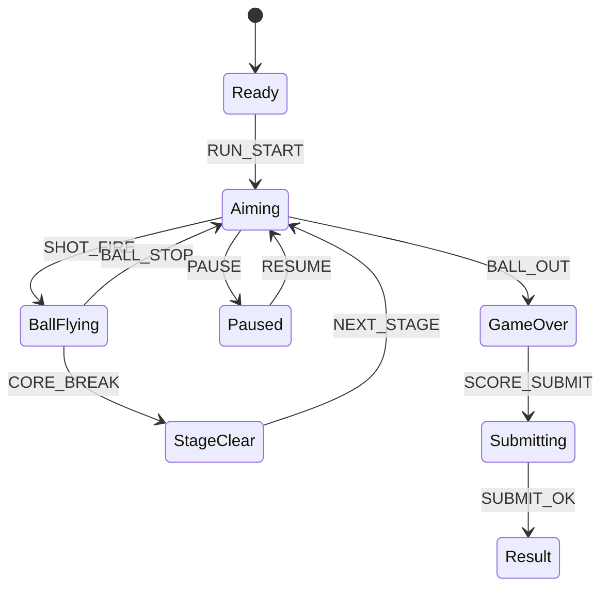

# Tower Bounce Breaker

## 한 줄 컨셉
공의 반사각을 활용해 블록 타워를 연쇄 파괴하며 점수를 누적하는 브레이커 액션.

## 리더보드 점수 공식
- 최종 점수 = 블록 파괴 점수 + 연쇄 반사 보너스 + 스테이지 클리어 보너스

## 동점 처리
- 동점 시 1) 최소 샷 수 적은 순 2) 클리어 시간 짧은 순 3) 먼저 달성한 기록 순

## 장르/플랫폼
- 장르: 브릭 브레이커 변형
- 플랫폼: Web(React)
- 플레이 타임: 스테이지 1분 내외

## 핵심 루프
- 각도 조준 발사 -> 반사/파괴 연쇄 -> 아이템 획득 -> 다음 층 진입

## 조작
- 마우스 드래그: 조준, 클릭: 발사

## 리더보드 운영 메모
- 시즌 단위(예: 4주)로 초기화하고 시즌 최고 점수 1개만 반영
- 서버에서 점수 이벤트 로그를 재집계해 클라이언트 제출 점수 검증

## 상태머신 다이어그램

## 이벤트 타입 정의
- `RUN_START`: `{ runId, stage, seed, ts }`
- `SHOT_FIRE`: `{ runId, angle, power, ts }`
- `BLOCK_HIT`: `{ runId, blockId, hpAfter, ts }`
- `BLOCK_BREAK`: `{ runId, blockId, scoreDelta, chain, ts }`
- `WALL_BOUNCE`: `{ runId, comboBounce, ts }`
- `CORE_BREAK`: `{ runId, stage, bonusScore, ts }`
- `RUN_END`: `{ runId, reason, stageReached, finalScore, ts }`

