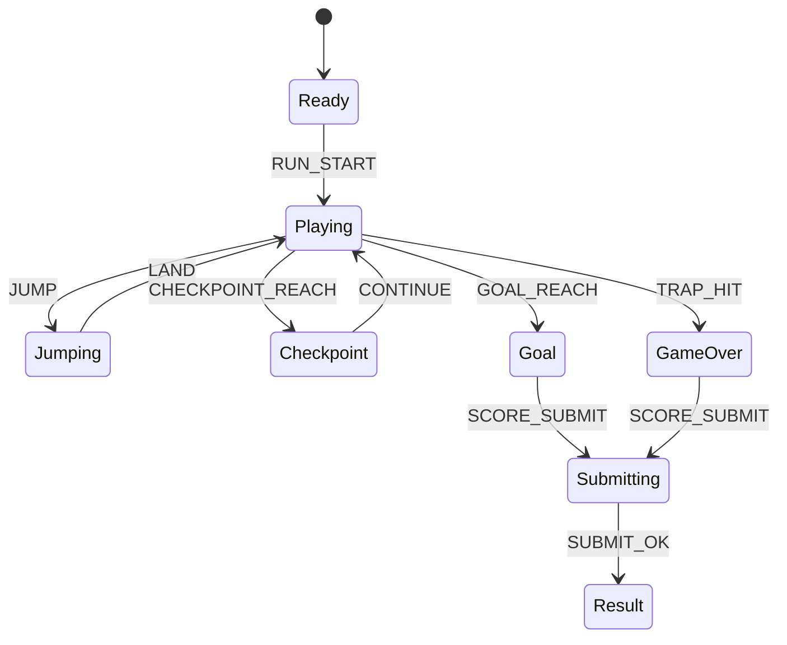

# Vault Jump Fever

## 한 줄 컨셉
트랩 방을 연속 점프로 돌파해 체크포인트와 남은 시간 점수를 확보하는 점프 챌린지.

## 리더보드 점수 공식
- 최종 점수 = 체크포인트 점수 + 연속 점프 콤보 보너스 + 남은 시간(초) × 20

## 동점 처리
- 동점 시 1) 클리어 시간 짧은 순 2) 낙하/피격 횟수 적은 순 3) 먼저 달성한 기록 순

## 장르/플랫폼
- 장르: 점프 챌린지
- 플랫폼: Web(React)
- 플레이 타임: 2~3분

## 핵심 루프
- 봉 점프 각도 조절 -> 트랩 회피 -> 콤보 유지 -> 결승 도달

## 조작
- 좌/우: 이동, Space: 점프, Shift: 공중 보정

## 리더보드 운영 메모
- 시즌 단위(예: 4주)로 초기화하고 시즌 최고 점수 1개만 반영
- 서버에서 점수 이벤트 로그를 재집계해 클라이언트 제출 점수 검증

## 상태머신 다이어그램

## 이벤트 타입 정의
- `RUN_START`: `{ runId, stageId, timeLimitSec, ts }`
- `JUMP`: `{ runId, power, ts }`
- `LAND`: `{ runId, platformId, combo, ts }`
- `TRAP_HIT`: `{ runId, trapId, hpAfter, ts }`
- `CHECKPOINT_REACH`: `{ runId, checkpointId, remainSec, scoreDelta, ts }`
- `GOAL_REACH`: `{ runId, remainSec, clearBonus, ts }`
- `RUN_END`: `{ runId, reason, finalScore, ts }`

